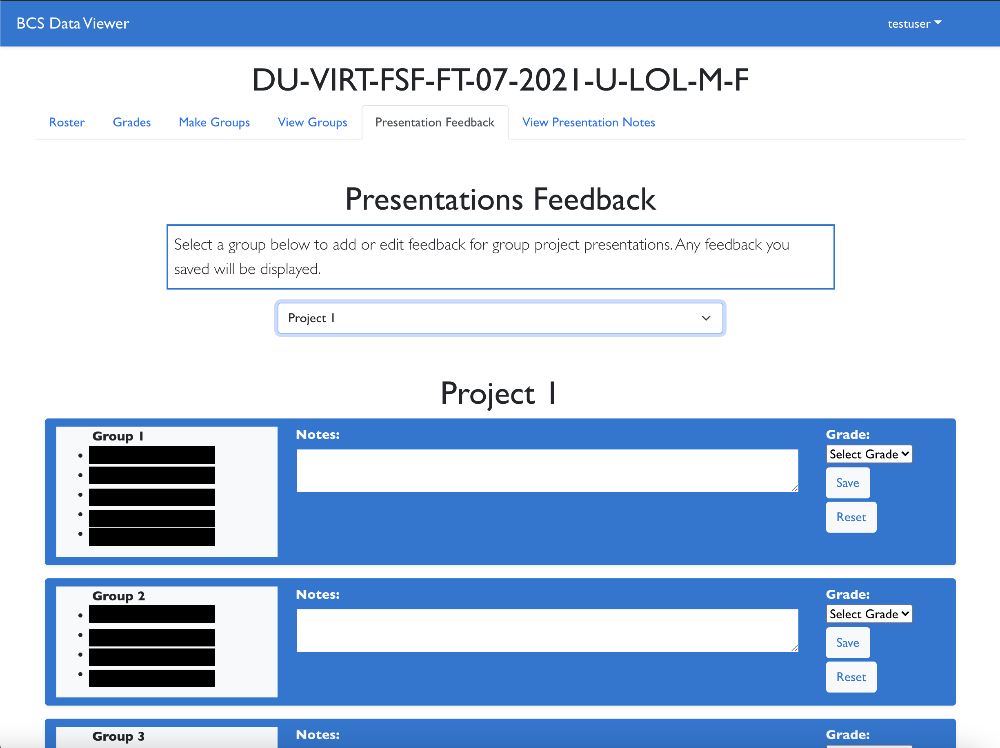

# <a href="http://bcs-data-viewer.herokuapp.com/">BCS Data Viewer</a>

<!--   -->

## Description: 
This application is to be used by the instructional staff for a 2U/Trilogy coding bootcamp.  It uses the BootcampSpot API to gather data about cohorts associated with the logged-in user. This application will simplify many of the time-consuming tasks such as forming project groups, viewing grade patterns throughout the cohort, and taking notes/grading of group projects and presentations. 

* **Note:** This application is not *officially* affiliated with 2U or Trilogy Education Services. This is a personal project meant to function as a tool for instructors and TA's working in Trilogy Boot Camps.

## Table of Contents

* [Installation](#installation)
* [Usage](#usage)
* [Contributing](#contributing)
* [Questions](#questions)

## Installation: 
To install locally, clone this repository and then run `npm i` from the root directory to install all required packages. 

To run the project on your local machine run `npm run develop` and all servers will start (React server will run on PORT 3000, backend/Mongo server will run on PORT 3001)

## Usage: 
1. Navigate your browser to the application homepage ([click here](https://https://bcs-data-viewer.herokuapp.com/)). You will automatically be directed to the login page: 

* If you have an account, log-in. Or, if you do not have an account, click on Register Here to be directed to the registration page:
 

**Note:** BCS Information is referring to the login email and password you use to access cohort and student data on bootcampspot.com.

2. Once you are logged in you will see the 'cohort select' page. If this is your first time logging in you will see a message that you are not connected to any cohorts. 
 

* Clicking the button at the bottom of the page will query the Boot Camp Spot API to retrieve all cohorts to which you are associated. 
 

 
Click Connect! to save the cohort to your user profile. 
 

* **Note:** If you see the following error, your BCS Login Information is incorrect:
 

 
Click the button, or select 'Update User Info' from the drop-down menu at the top of the page to view and update your user information, including your BCS login information.
 

* Once you have connected to a cohort, the cohort code will appear at the top of the page:
 

 
Clicking the cohort code will redirect you to the cohort information page, where you can see all related cohort data.

3. Cohort Page and Tools:
* **Roster:** View all enrolled students. Move students between the 'active' and 'inactive' list:
 

* **Grades:** View all student grades on all assignments in a single table. Table can be organized by Name (alphabetical) or AVG grade:
 

* **View/Make Groups:** Form project and/or class activity groups. Select a number of groups to form and click "Form Groups". Once a set of groups has been saved to the cohort, the option to create groups with 'no repeats' becomes available. Clicking this option will allow you to select a group for comparison, and then form a set of groups wherein no students are working with someone they have already worked with. Click the 'View Groups' tab to view all saved group sets: 

 
    
    

* **Presentation Feedback/View Feedback:** Enter notes and a prospective grade for each group in a particular set during group project presentations. Click 'View Feedback' and select a group set to view all notes from all users. 

## Contributing:

## Questions:
* GitHub Profile:  [the-medium-place](https://github.com/the-medium-place)
* Email: <zgstowell@gmail.com>

